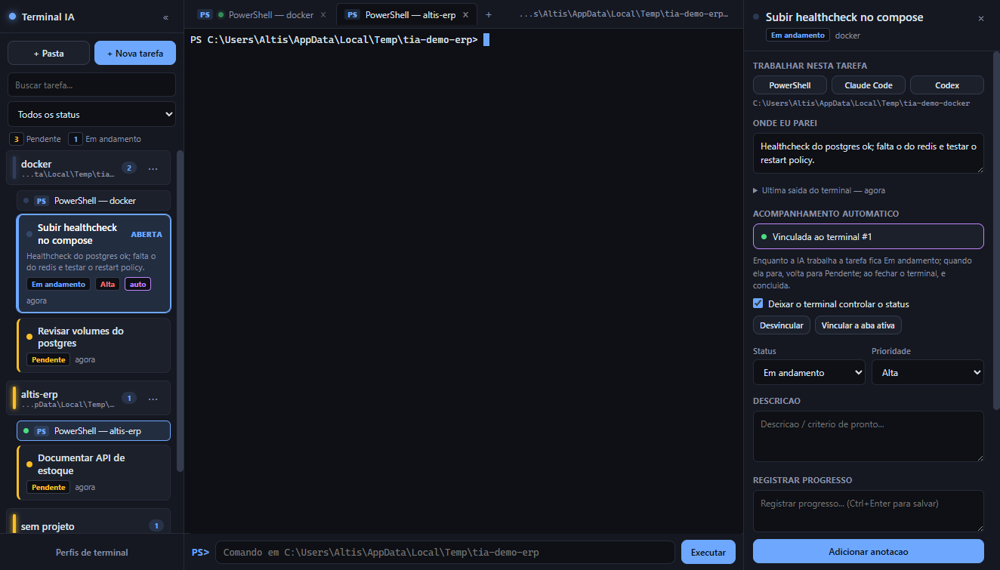

# Terminal IA

Gerenciador de terminais multi-projeto para Windows, feito para quem trabalha com **Claude Code** e
**Codex** em várias pastas ao mesmo tempo.

Em vez de abrir uma janela de terminal, navegar até a pasta, subir o `claude`, e repetir isso para
cada projeto, você cadastra as pastas uma vez. Depois é um clique: o terminal abre **já posicionado
na pasta certa e com a IA rodando**. Tudo em abas, numa janela só.

A unidade de trabalho é o **terminal**, não uma tarefa à parte. Abriu o Claude na pasta X? Aquele
terminal tem o seu próprio bloco de anotações. Abriu um Codex ao lado? Outro bloco, independente.
`Ctrl+Shift+N` anota no terminal em que você está. Quando você fecha a aba, aquele terminal — com
tudo que você anotou nele — vira registro no **histórico do trabalho**.



---

## Instalação (para usar)

Baixe ou gere os arquivos da pasta `dist/` (veja a seção seguinte) e escolha um dos dois:

| Arquivo | O que é |
|---|---|
| `TerminalIA-0.1.0-x64.exe` | **Sim, é um instalador.** Assistente com telas de avanço |
| `TerminalIA-0.1.0-portable.exe` | Executável avulso — roda direto, sem instalar nada |

**Respondendo diretamente à dúvida:** o `-x64.exe` é o instalador (NSIS). Ele abre um assistente,
deixa você **escolher a pasta de instalação**, cria atalho na **área de trabalho** e no **menu
Iniciar**, e registra o programa em *Aplicativos instalados* do Windows, com desinstalador. A
instalação é **por usuário — não pede senha de administrador**.

O `-portable.exe` é o mesmo aplicativo num arquivo só: dá dois cliques e usa. Não cria atalhos nem
aparece na lista de programas. Bom para pendrive ou para testar antes de instalar.

Os dois compartilham o mesmo banco de dados (`%APPDATA%\terminal-ia`), então seus projetos,
anotações e histórico são os mesmos independente de qual você abrir.

> **Aviso do Windows ao abrir.** O executável não é assinado digitalmente, então o SmartScreen mostra
> "O Windows protegeu o computador". Clique em **Mais informações → Executar assim mesmo**. Para
> eliminar o aviso seria preciso um certificado de assinatura de código (pago).

### Pré-requisitos de uso

Windows 10 ou 11 (64 bits). O app **não instala** o Claude Code nem o Codex — ele apenas os chama.
Para os perfis de IA funcionarem, `claude` e `codex` precisam estar instalados e acessíveis no PATH.
Se não estiverem, a aba abre mesmo assim, com um PowerShell normal e a mensagem de comando não
encontrado.

---

## Gerar o executável

### O que você precisa

- **Windows 10/11 x64**
- **Node.js 20 ou superior** ([nodejs.org](https://nodejs.org))
- **Nada além disso.** Não precisa de Visual Studio Build Tools, Python nem `electron-rebuild` — o
  projeto foi montado sem nenhum módulo nativo que precise ser compilado (veja *Arquitetura*).

### Passo a passo

```powershell
cd C:\GitHub\terminal_ia

npm install          # instala dependências e copia os assets do xterm (postinstall)
npm run dist         # gera o instalador e o portátil em dist/
```

Só isso. O primeiro `npm run dist` baixa o Electron (~100 MB) e as ferramentas do NSIS, então
demora alguns minutos; as builds seguintes levam menos de um minuto.

Ao terminar, a pasta `dist/` contém:

```
dist/
  TerminalIA-0.1.0-x64.exe          instalador      (~99 MB)
  TerminalIA-0.1.0-portable.exe     portátil        (~99 MB)
  TerminalIA-0.1.0-x64.exe.blockmap usado para atualizações incrementais
  win-unpacked/                     app já descompactado (~356 MB) — útil para depurar
```

### Todos os comandos

| Comando | O que faz |
|---|---|
| `npm start` | Roda em modo desenvolvimento, sem empacotar |
| `npm run dist` | Gera **instalador + portátil** |
| `npm run dist:portable` | Gera **só o portátil** (mais rápido) |
| `npm run pack` | Só descompactado em `dist/win-unpacked/`, sem gerar `.exe` |
| `npm run icone` | Regenera `build/icon.ico` (o ícone é desenhado por código, sem editor) |
| `npm run vendor` | Recopia os assets do xterm para `src/renderer/vendor/` |

### Mudar a versão do executável

O número no nome do arquivo vem do `package.json`:

```powershell
npm version patch --no-git-tag-version   # 0.1.0 -> 0.1.1
npm run dist
```

### Se o build falhar com erro de link simbólico

Numa máquina nova, o `electron-builder` pode falhar assim:

```
ERROR: Cannot create symbolic link : O cliente não tem o privilégio necessário.
  ...winCodeSign\...\darwin\10.12\lib\libcrypto.dylib
```

Ele está tentando extrair as ferramentas de assinatura **do macOS** (inúteis no Windows), e o
Windows bloqueia a criação de links simbólicos sem privilégio elevado.

Rode o bloco abaixo **depois da tentativa que falhou** — ele reaproveita o `.7z` que o
electron-builder já baixou para o cache e o extrai à mão, pulando a pasta `darwin`:

```powershell
$cache = "$env:LOCALAPPDATA\electron-builder\Cache\winCodeSign"
$alvo  = Join-Path $cache "winCodeSign-2.6.0"
$z     = ".\node_modules\7zip-bin\win\x64\7za.exe"

Get-ChildItem $cache -Directory -ErrorAction SilentlyContinue | Remove-Item -Recurse -Force
New-Item -ItemType Directory -Force $alvo | Out-Null
& $z x -snld -bd -y "-o$alvo" (Get-ChildItem $cache -Filter *.7z | Select-Object -First 1).FullName "-x!darwin"
Remove-Item "$cache\*.7z" -Force

npm run dist
```

Alternativa: ativar o **Modo de Desenvolvedor** do Windows (Configurações → Sistema → Para
desenvolvedores), que permite criar links simbólicos sem elevação.

---

## Funcionalidades

### Barra lateral: o que está aberto agora

Cada projeto é um bloco com os **terminais abertos** dele logo abaixo. Terminais sem projeto caem
num grupo "sem projeto" no fim. Terminal fechado **não** fica aqui — ele foi para o histórico.
Clicar no cabeçalho (ou em `⋯`, ou botão direito) abre o modal do projeto, de onde se lança um
terminal com qualquer perfil, se abre a pasta no Explorer, se edita ou se remove.

Cada terminal aparece com um ponto colorido:

- 🔵 **azul piscando** — a IA está trabalhando agora
- 🟢 **verde** — terminal ocioso, esperando você
- 🔴 **vermelho** — o processo morreu

Clicar leva à aba, `✎` abre as anotações dele (com o total ao lado, quando tem), e `×` fecha o
terminal — mandando-o para o histórico.

### Cores comunicam situação, não decoração

Não existe cor fixa por projeto. A faixa do bloco mostra o que os terminais daquele projeto estão
fazendo: azul piscando se algum está trabalhando, verde se há algum ocioso, vermelho se todos
morreram, apagada se não há nenhum aberto.

### Perfis de terminal

Vêm quatro prontos: **PowerShell**, **Claude Code**, **Codex** e **CMD**. O shell sempre sobe
primeiro e o comando da IA é digitado nele em seguida — assim, se o `claude` encerrar ou não estiver
no PATH, você continua com um terminal utilizável em vez de uma aba morta.

Dá para criar perfis próprios (`npm run dev`, `docker compose up`, o que for) em *Perfis de
terminal*, no rodapé da barra lateral.

### Barra de comando

O campo no rodapé manda um comando PowerShell direto para a aba ativa, sem tirar o foco do que você
está fazendo. Seta ↑/↓ percorre o histórico, que é gravado por projeto.

### Anotações por terminal

A anotação pertence ao terminal. Dois terminais na mesma pasta são dois blocos separados: o que você
escreveu no Claude não se mistura com o que escreveu no Codex ao lado.

`Ctrl+Shift+N` abre o bloco do terminal em que você está — sem tirar o foco de lugar nenhum e sem
abrir outro terminal. Escreva e salve com `Ctrl+Enter` (ou no botão). As anotações ficam listadas
com data, e cada uma pode ser excluída. O `✎` na barra lateral abre o bloco de qualquer terminal.

### Onde eu parei

Além do que você escreve, o app captura sozinho as últimas linhas do terminal toda vez que a IA
para de trabalhar ou você fecha a aba. Fica em *Última saída do terminal*, dentro do bloco de
anotações, com a data. Ao voltar naquele terminal — ou ao reabri-lo pelo histórico dias depois — o
contexto está lá.

### Histórico do trabalho

`Ctrl+Shift+H` (ou o botão no rodapé da barra lateral) abre o histórico: **os terminais que você já
fechou**, agrupados por dia, do mais recente para o mais antigo. Cada linha traz o perfil, o
projeto, o horário de abertura e fechamento, a duração e a última anotação.

Todo terminal fechado é registrado, mas os que receberam anotação são os que contam como trabalho
feito: eles vêm em destaque, com `✓` e a contagem de anotações, enquanto os demais ficam esmaecidos.
A caixa *Esconder terminais sem anotação* deixa só os que interessam. A busca varre título, pasta e
o texto das anotações.

Clicar numa entrada abre as anotações daquele terminal — onde ainda dá para anotar mais e onde há
**Reabrir um terminal aqui**, que sobe um terminal novo na mesma pasta e com o mesmo perfil. O `×`
remove a entrada do histórico junto com suas anotações.

### Como a atividade da IA é detectada

Claude Code e Codex redesenham a tela continuamente enquanto processam (spinner, contador de tokens)
e ficam em silêncio ao aguardar você. O app observa o fluxo de saída do PTY: **2,5 s de silêncio =
ocioso**. Os rótulos de interrupção (`esc to interrupt`) reforçam a detecção enquanto estão visíveis.

É o que acende o ponto azul na barra lateral e o que dispara a captura de *onde eu parei*. É
heurística, não uma API oficial.

Duas fontes de ruído são descontadas de propósito, porque ambas produziam falsos "trabalhando":

- **Boot do shell e da IA.** A sessão só começa a reportar atividade depois de assentar pela primeira
  vez (ou após 20 s, caso a IA emende direto no processamento). Sem isso, abrir o terminal já o
  marcaria como trabalhando.
- **Redesenho por `resize`.** Trocar de aba redimensiona o ConPTY e o shell repinta a tela inteira.
  A saída dos ~0,9 s seguintes a um resize é ignorada — senão bastava clicar na interface para o
  terminal piscar como ativo.

---

## Atalhos

| Atalho | Ação |
|---|---|
| `Ctrl+Shift+T` | Novo terminal |
| `Ctrl+Shift+W` | Fechar terminal |
| `Ctrl+Shift+R` | Reiniciar o terminal da aba (útil se o processo morreu) |
| `Ctrl+Shift+O` | Adicionar pasta de projeto |
| `Ctrl+Shift+N` | Anotar no terminal ativo |
| `Ctrl+Shift+H` | Histórico do trabalho |
| `Ctrl+Shift+B` | Mostrar/esconder barra lateral |
| `Ctrl+Shift+K` | Focar a barra de comando |
| `Ctrl+Tab` | Próxima aba |
| `Ctrl+1..9` | Ir para a aba N |
| `F5` / `F12` | Recarregar interface / DevTools |

Os atalhos usam `Ctrl+Shift` de propósito: `Ctrl+W`, `Ctrl+K`, `Ctrl+B` e `Ctrl+R` sozinhos são
bindings do PSReadLine e seriam roubados do shell.

---

## Atualizações automáticas

O app checa por versão nova ao abrir e depois a cada 4h, baixa em segundo plano (silencioso, sem
diálogo do Windows) e avisa dentro da própria janela quando puder reiniciar para instalar — só
reinicia quando você clicar em "Reiniciar agora". *Arquivo → Verificar atualizações* força uma
checagem manual a qualquer momento.

Isso só instala pelo instalador (`nsis`); a versão portátil não recebe update automático — baixe
uma nova toda vez que quiser trocá-la.

### Publicar uma versão nova

1. Preencha `owner` em `package.json` → `build.publish` com a conta/organização dona do repositório
   no GitHub (hoje está `PREENCHER_DONO_DO_REPO`).
2. O repositório é **privado**, então a máquina que builda **e** as máquinas que rodam o app
   precisam de um token do GitHub com leitura do repositório, na variável de ambiente `GH_TOKEN`
   (ou `GITHUB_TOKEN`) — **configurada nas Variáveis de Ambiente do Windows** (não só na sessão do
   PowerShell), senão o app não a enxerga quando aberto pelo atalho. O token não fica embutido no
   `.exe`: cada instalação precisa da própria variável configurada pra baixar updates.
3. Suba a versão e publique:
   ```powershell
   npm version patch --no-git-tag-version   # 0.1.0 -> 0.1.1
   npm run release                          # builda e publica a release no GitHub
   ```
   `npm run release` só funciona com o `GH_TOKEN` acima presente no ambiente — é ele quem
   autentica o `electron-builder` a criar a release e subir os artefatos.

## Onde ficam os dados

Tudo num SQLite em `%APPDATA%\terminal-ia\terminal-ia.db`: projetos, perfis, terminais (abertos e
os já encerrados, que formam o histórico), anotações, capturas de tela, histórico de comandos e
tamanho da janela.

As abas abertas são registradas e **recriadas na próxima abertura** — o processo é novo, o histórico
de rolagem anterior não volta. As migrações de schema são idempotentes, então atualizar o app não
apaga seus dados. Versões antigas guardavam tarefas em `tasks`/`task_notes`; essas tabelas não são
mais usadas, mas continuam no arquivo, intactas.

Para começar do zero, feche o app e apague essa pasta.

---

## Arquitetura

```
src/
  main/              processo principal (Node) — o renderer não alcança daqui
    main.js          janela, menu, ciclo de vida
    db.js            schema, migrações e queries (node:sqlite)
    pty-manager.js   PTYs reais via ConPTY + detecção de atividade
    updater.js       checagem/download/instalação de atualização (GitHub Releases)
    ipc.js           handlers IPC, todos retornando { ok, data | error }
  preload.js         ponte contextBridge — única superfície exposta ao renderer
  renderer/          interface (ES modules puros, sem bundler)
    js/
      app.js         inicialização, atalhos, barra de comando
      lateral.js     barra lateral (projetos + terminais abertos)
      terminais.js   abas, xterm, encaixe automático
      projetos.js    CRUD de projetos e perfis
      anotacoes.js   bloco de anotações de um terminal
      historico.js   terminais já encerrados, agrupados por dia
      painel.js      abre/fecha o painel da direita, compartilhado pelos dois
      ui.js          helpers de DOM, modais, avisos
      estado.js      estado compartilhado + barramento de eventos
    vendor/          xterm.js copiado do node_modules (gerado, não versionar)
scripts/
  copy-vendor.js     roda no postinstall
  gerar-icone.js     desenha build/icon.ico por código, sem dependências
build/
  icon.ico           ícone do app e do instalador
```

Decisões que valem registro:

- **Zero módulos nativos compilados.** `@lydell/node-pty` traz binários pré-compilados e o SQLite é
  o `node:sqlite` embutido no Node do Electron. É por isso que clonar e buildar não exige Visual
  Studio Build Tools nem Python.
- **`contextIsolation: true`, `nodeIntegration: false`.** O renderer não toca em Node; tudo passa
  pelo `preload.js`, e há CSP restritiva no `index.html`.
- **Sem bundler no renderer.** ES modules nativos; o único passo de build é copiar o xterm.
- **Por que Electron e não Python.** O coração do app é emular um terminal de verdade — as TUIs do
  Claude e do Codex usam ANSI, cursor absoluto, mouse e resize dinâmico. O `xterm.js` (o mesmo
  emulador do VS Code) resolve isso; no Windows não existe equivalente maduro em Python, o que
  significaria escrever um parser ANSI do zero.

### Layout responsivo

As colunas mudam por faixa de janela (280/244/212 px na lateral; 380/340/320 px no painel da
direita). Abaixo de 1100 px, abrir o painel **recolhe a barra lateral** em vez de espremer o
terminal — sobrepor o painel esconderia a barra de comando. O terminal é reencaixado a cada mudança
de tamanho, com verificação: se o `fit` sair maior que o espaço disponível (layout ainda em
transição), ele refaz.

Duas armadilhas que custaram bug aqui, registradas para não voltarem:

- **`clamp()` com `vw`** resolvia com o viewport anterior durante o resize, deixando lateral e painel
  nos valores máximos e o terminal com 134 px. Trocado por media queries.
- **`requestAnimationFrame` não dispara com a janela oculta ou minimizada.** O reencaixe usa
  `setTimeout`, senão o terminal volta do minimizado com o tamanho antigo.

### Saída do PTY: lote e contrapressão

Sem isso, uma sessão com saída rápida e sustentada (a IA rodando uma bateria de testes, por
exemplo) mandava uma mensagem IPC por chunk do PTY e escrevia cada uma direto no xterm.js —
inclusive em abas ocultas, que continuam vivas de propósito. A fila interna de escrita do
xterm.js cresce de forma assíncrona; quando a produção é mais rápida que o parse+render por um
tempo sustentado, essa fila nunca esvazia e a memória/CPU do processo sobe até travar a máquina.

`pty-manager.js` agora agrupa os chunks de uma janela de 16 ms numa única mensagem e aplica
contrapressão real: cada sessão rastreia bytes mandados e ainda não confirmados pelo renderer:
passou de 200 KB, pausa o PTY (`pause()`); o renderer confirma via IPC assim que o `term.write()`
termina de processar aquele lote (callback do xterm.js); confirmado abaixo de 50 KB, retoma
(`resume()`). Vale para abas visíveis e ocultas igualmente — é nelas que o problema aparecia.

---

## Licença

MIT.
